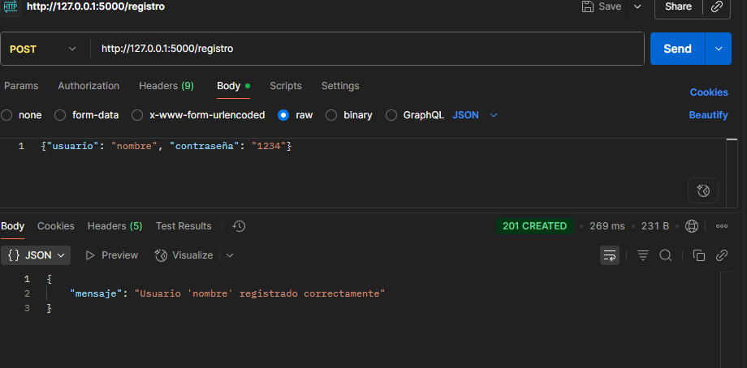
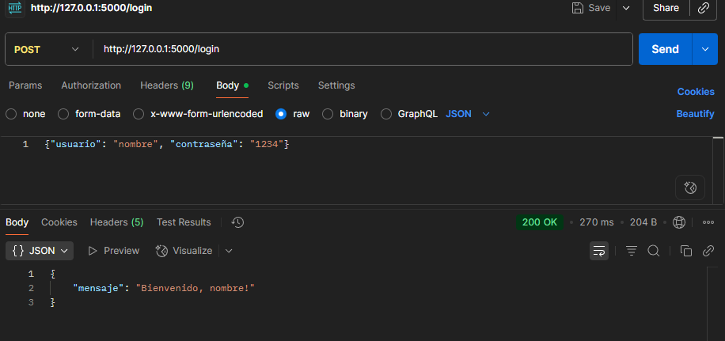
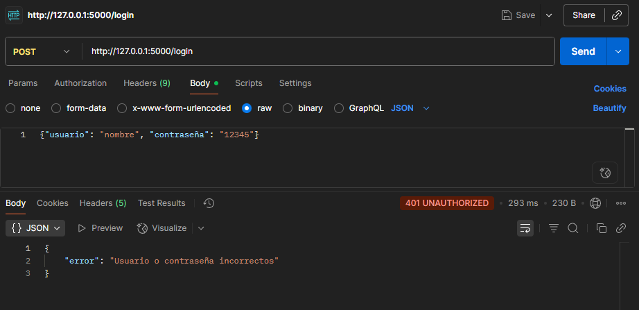
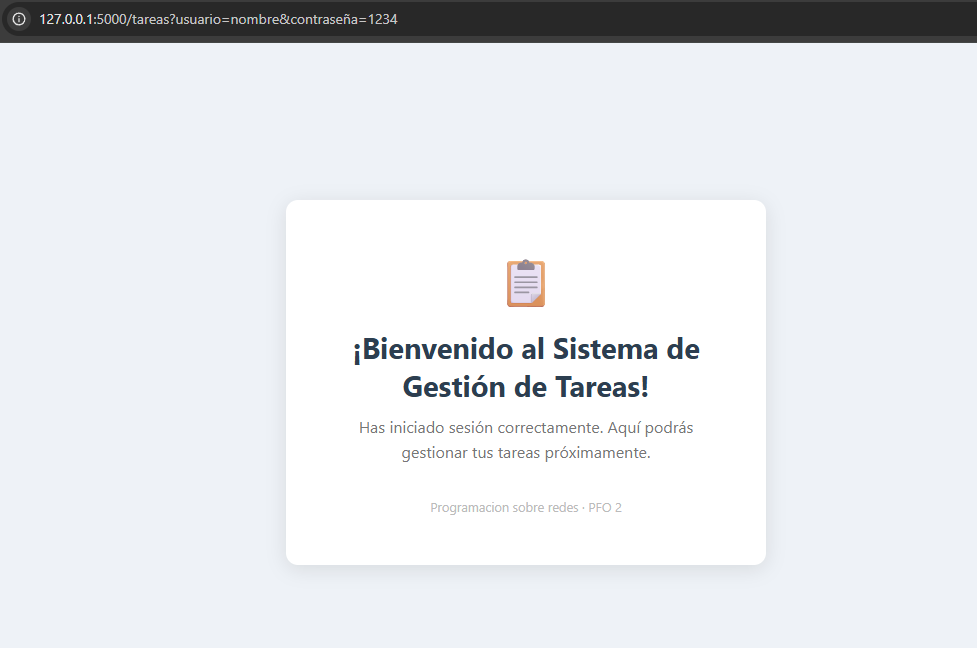
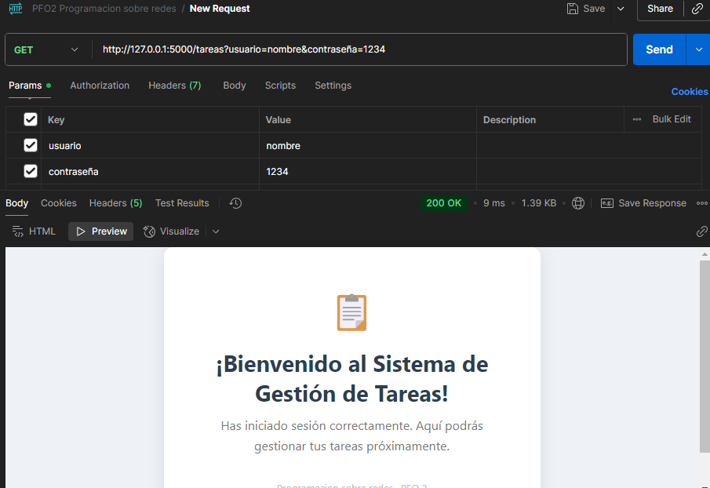
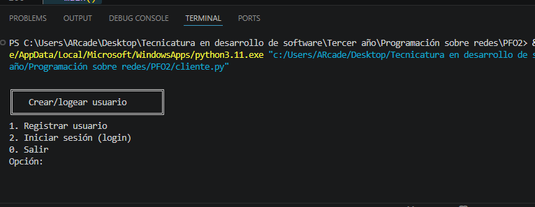

# Sistema de Gestión de Tareas – PFO 2

API REST construida con **Flask** y **SQLite**, con autenticación y contraseñas hasheadas, y un cliente de consola interactivo.

---

## Estructura del proyecto

```
PFO2/
├── servidor.py      # API Flask + SQLite
├── cliente.py       # Cliente de consola
├── tareas.db        # Base de datos (se crea automáticamente)
├── assets/         # carpeta de imagenes
└── README.md
```

---

## Requisitos

- Python 3.8 o superior
- pip

### Instalación de dependencias

```bash
pip install flask bcrypt requests
```

---

## Cómo ejecutar el proyecto

### 1. Iniciar el servidor

```bash
python servidor.py
```

Verás el mensaje:
```
Servidor corriendo en http://127.0.0.1:5000
```

### 2. Usar el cliente de consola (en otra terminal)

```bash
python cliente.py
```

El menú ofrece dos opciones:
```
╔══════════════════════════════╗
║   Crear/logear usuario       ║
╚══════════════════════════════╝
1. Registrar usuario
2. Iniciar sesión (login)
0. Salir
```

- **Opción 1:** Registra un nuevo usuario. Pide nombre de usuario y contraseña (no permite campos vacíos).
- **Opción 2:** Inicia sesión. Si las credenciales son correctas, abre automáticamente el navegador con la página de bienvenida.

---

## Endpoints de la API

| Método | Ruta        | Descripción                            |
|--------|-------------|----------------------------------------|
| POST   | `/registro` | Registra un nuevo usuario              |
| POST   | `/login`    | Verifica credenciales                  |
| GET    | `/tareas`   | Devuelve una página HTML de bienvenida |

---

## Pruebas con Postman

### Registrar usuario
- **Método:** POST  
- **URL:** `http://127.0.0.1:5000/registro`  
- **Body → raw → JSON:**
```json
{"usuario": "nombre", "contraseña": "1234"}
```
**Respuesta exitosa (201):**
```json
{"mensaje": "Usuario 'nombre' registrado correctamente"}
```
**Usuario ya existente (409):**
```json
{"error": "El usuario 'nombre' ya existe"}
```

---

### Iniciar sesión
- **Método:** POST  
- **URL:** `http://127.0.0.1:5000/login`  
- **Body → raw → JSON:**
```json
{"usuario": "nombre", "contraseña": "1234"}
```
**Respuesta exitosa (200):**
```json
{"mensaje": "Bienvenido, nombre!"}
```
**Credenciales incorrectas (401):**
```json
{"error": "Usuario o contraseña incorrectos"}
```

---

### Ver página de bienvenida
- **Método:** GET  
- **URL:** `http://127.0.0.1:5000/tareas`  

O abrí directamente en el navegador:
```
http://127.0.0.1:5000/tareas
```

---

## Respuestas Conceptuales

### ¿Por qué hashear contraseñas?

Hashear contraseñas es una práctica de seguridad fundamental. Si la base de datos es robada o filtrada, el atacante nunca obtiene la contraseña real, sino un hash irreversible. La librería `bcrypt` agrega un **salt** aleatorio a cada hash, lo que impide ataques de diccionario o tablas arcoíris (_rainbow tables_). Guardar contraseñas en texto plano es una vulnerabilidad crítica: si el servidor es comprometido, todas las cuentas quedan expuestas.

### Ventajas de usar SQLite en este proyecto

1. **Sin servidor separado:** SQLite es un motor embebido, no requiere instalar ni configurar nada adicional.
2. **Portabilidad:** toda la base de datos vive en un único archivo (`tareas.db`) fácil de copiar o mover.
3. **Ideal para proyectos pequeños:** para un proyecto de consola con pocos usuarios, SQLite es suficiente y mucho más simple que MySQL o PostgreSQL.
4. **Incluido en Python:** el módulo `sqlite3` viene en la biblioteca estándar, sin instalación adicional.

---

## Capturas de pantalla

- /registro – Respuesta 201 al registrar usuario en Postman 
- /login - Respuesta 200 al iniciar sesión en Postman  
- /login – Respuesta 401 con credenciales incorrectas 
- /tareas – Página HTML de bienvenida en el navegador 
- /tareas - Respuesta 200 con parametros correctos 
- Consola – Sesión con el cliente de consola 

---

## GitHub Pages

Para publicar la documentación en GitHub Pages:

1. Subir el proyecto a un repositorio en GitHub.
2. Ir a **Settings → Pages**.
3. Seleccionar la rama `main` y la carpeta raíz `/`.
4. GitHub Pages publicará el `README.md` como página web del proyecto.

> **Nota:** el servidor Flask no puede ejecutarse en GitHub Pages ya que es hosting estático. Pages sirve únicamente para mostrar la documentación del proyecto.
